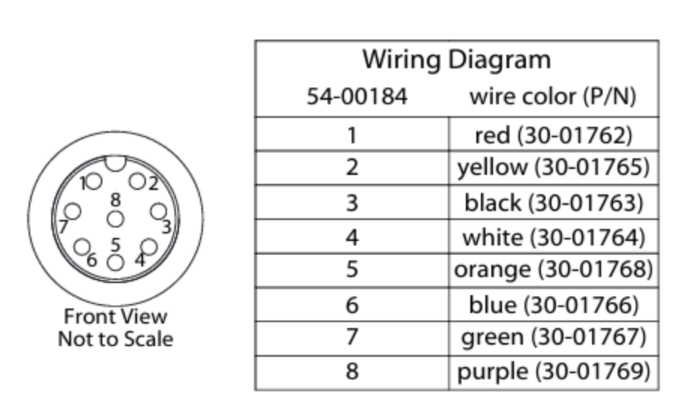
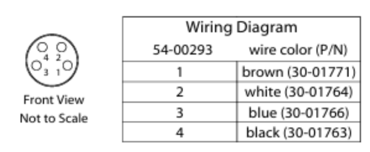
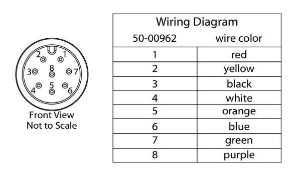
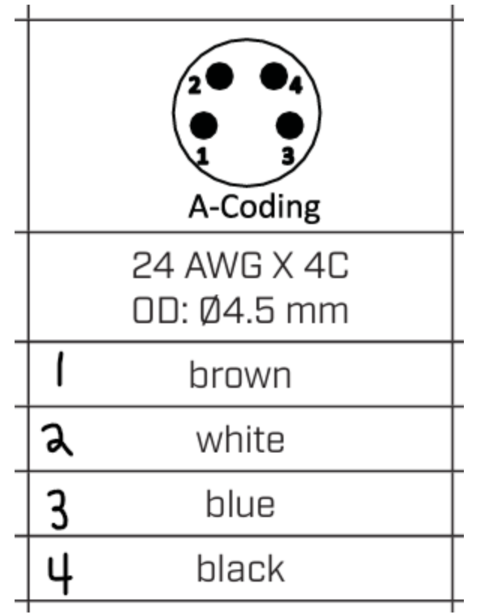

*******************
Harness Colour Code
*******************

Recovery Bulkhead to E-matches/Payload
======================================

M12 pinout (839-10-04040-ND):
-----------------------------

.. list-table:: M12 Colour Code
   :widths: 10 45 45
   :header-rows: 1

   * - Pin Number
     - Colour
     - Usage
   * - 1
     - Red
     - CHARGE
   * - 2
     - Yellow
     - CANL
   * - 3
     - Black
     - GND
   * - 4
     - White
     - Drogue
   * - 5
     - Orange
     - Main
   * - 6
     - Blue
     - Main
   * - 7
     - Green
     - CANH
   * - 8
     - Purple
     - Drogue

M8 pinout (839-10-05256-ND)
---------------------------

.. list-table:: M8 Colour Code
   :widths: 10 45 45
   :header-rows: 1

   * - Pin Number
     - Colour
     - Usage
   * - 1
     - Brown
     - Drogue
   * - 2
     - White
     - Main
   * - 3
     - Blue
     - Drogue
   * - 4
     - Black
     - Main

Recovery Bulkhead to Recelec/Remote Arming
==========================================

M12 pinout (839-10-04505-ND)
----------------------------

.. list-table:: M12 Colour Code
   :widths: 10 45 45
   :header-rows: 1

   * - Pin Number
     - Colour
     - Usage
   * - 1
     - Red
     - CHARGE
   * - 2
     - Yellow
     - CANL
   * - 3
     - Black
     - GND
   * - 4
     - White
     - Drogue
   * - 5
     - Orange
     - Main
   * - 6
     - Blue
     - Main
   * - 7
     - Green
     - CANH
   * - 8
     - Purple
     - Drogue

M8 pinout (2223-CDM815-04A-01MST-1M-67-ND)
------------------------------------------

.. list-table:: M8 Colour Code
   :widths: 10 45 45
   :header-rows: 1

   * - Pin Number
     - Colour
     - Usage
   * - 1
     - Brown
     - Drogue
   * - 2
     - White
     - Main
   * - 3
     - Blue
     - Drogue
   * - 4
     - Black
     - Main
	   
Main Harness
============

.. list-table:: Main Harness Colour Code
   :widths: 20 10 35 35
   :header-rows: 1

   * - Netlabel
     - Pin Number
     - 26 AWG Colour
     - Tefzel Colour (White + Stripe)
   * - CHG
     - 1
     - Red
     - Red
   * - CANL
     - 2
     - Yellow
     - Orange
   * - CANH
     - 3
     - Green
     - Green
   * - GND
     - 4
     - Black
     - Black
   * - 5V
     - 5
     - Blue
     - Blue
   * - 12V
     - 5
     - White
     - White
