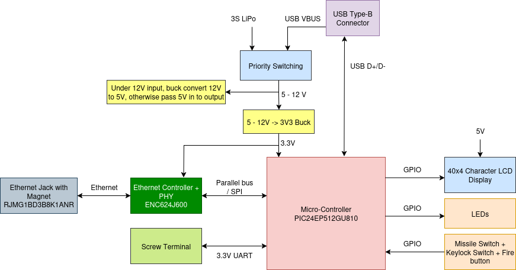

************************
RLCS V4 Clientside Board
************************

RLCS V4 Clientside board is the SRAD PCB inside the Clientside. The board connects to all internal electrical components in clientside. The board has a 5-12V to 3.3V buck converter to provide power to MCU, Ethernet Controller+PHY IC and missile switches. A 5-12V to 5V buck converter/switching circuit for providing power to LCD display. Ethernet Controller+PHY IC and Ethernet Jack with built-in magnet for Ethernet connection. A UART screw terminal as a back up solution of Ethernet does not work at board bring-up.

Requirements
============

.. list-table:: Clientside Board Requirements
   :widths: 15 30 55
   :header-rows: 1

   * - Req. ID
     - Description
     - Justification/Parent Requirement
   * - MECH. 1
     - Board shall have M3 mounting holes
     - Mount to RLCS Clientside face plate
   * - MECH. 2
     - Board shall be stacked vertically with LCD Display, with matching mounting hole with LCD display
     - Vertical connector can be used to ensure stable connection
   * - ELEC. 1
     - Board should have power priority switching between LiPo 12V and USB VBUS(5V)
     - Usually USB is connected to a computer with "unlimited" power source, so it should be priority
   * - ELEC. 2
     - Board shall have a 10/100 Mbps Ethernet connection
     - For communicate with towerside GLS board through local network
   * - ELEC. 3
     - Board shall have 3.3V LVCMOS UART connection
     - Backup if ethernet doesn't work
   * - ELEC. 4
     - Board shall have testpoint on all on-board digital communication lines
     - For debug with a logic analyzer later
