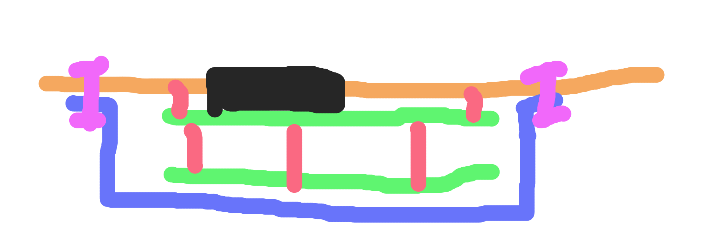

RLCS V4 Clientside
==================

.. toctree::
   :maxdepth: 2
   :caption: Boards

   clientside-board.rst

.. image:: clientside-box.png
   :align: center

Clientside is used by the RLCS Control operator to control motorized valves and ignition. Clientside is a relatively simple system composed of a SRAD PCB, a LCD module and several missile switches. Additionally, it exposes a USB port which allows it to send data to a computer for plotting and logging. Clientside contains a set of missile switch, each match to a motorized valve.

Refer to :doc:`RLCS v4</electrical-gse/rlcs-v4/index>` page for internal electrical connection diagram.

Requirements
============

.. list-table:: Clientside Requirements
   :widths: 15 30 55
   :header-rows: 1

   * - Req. ID
     - Description
     - Justification/Parent Requirement
   * - MECH. 1
     - System shall be in a waterproof(IP??) case
     - We don't want electronics get wet to a computer with "unlimited" power source, so it should be priority
   * - MECH. 2
     - System shall have a keylock switch on the face plate
     - For arm/disarm system
   * - MECH. 3
     - System shall have 12 missile switchs with LED lights
     - 10 valves/tank heating, 1 ignition arm and 1 injector arm, LED lights for indicate if system's armed
   * - MECH. 4
     - System shall have a 20x4 character LCD display
     - RLCS Operator can monitor system
   * - MECH. 5
     - System shall have a red/green multi colour LED
     - RLCS Operator see if system is connected to towerside
   * - MECH. 6
     - System should have a plastic case over electronics on the back side of the face plate (refer to diagram below)
     - Protect electronics
   * - ELEC. 1
     - System have a 10/100 Mbps Ethernet connection
     - For communicate with towerside GLS board through local network
   * - ELEC. 2
     - System shall have a Type B USB port
     - For get power from another device, and optional data logging
   * - ELEC. 3
     - System shall be able to power from the USB port(ELEC.2) or a 3S LiPo battery
     - Redundant power supply

