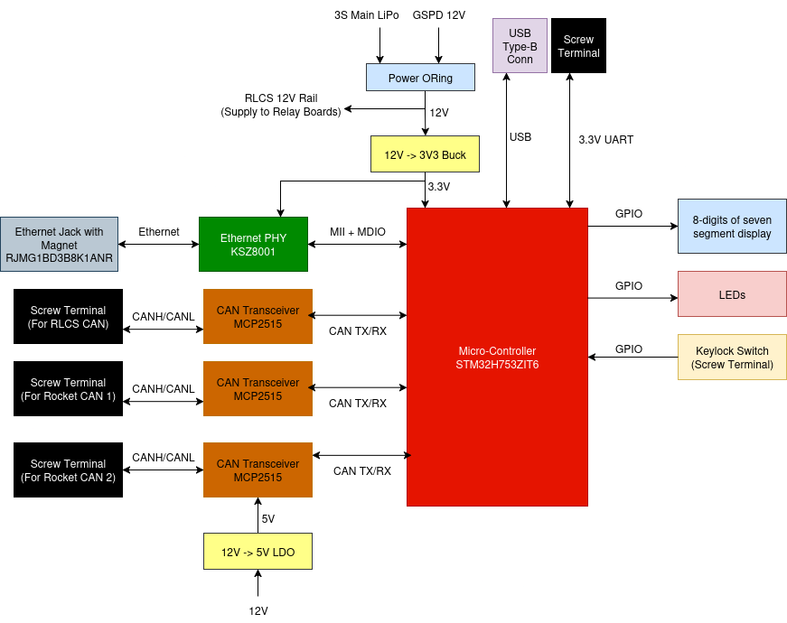

*************************************
RLCS V4 Ground Launch Sequencer Board
*************************************

Ground Launch Sequencer board is the main controller board of RLCS Towerside. It act as a bridge between Ethernet interface and various CAN interfaces.
		   
Requirements (GLSBoard)
=======================

.. list-table:: Ground Launch Sequencer Requirements
   :widths: 15 30 55
   :header-rows: 1

   * - Req. ID
     - Description
     - Justification/Parent Requirement
   * - MECH. 1
     - Board shall be no larger than 10 cm x 10 cm
     - Proper mounting in EGSE respin
   * - MECH. 2
     - Board shall have M3 mounting hole on each of the corner
     - For attaching to DIN rail mounting part
   * - ELEC. 1
     - Board shall have a screw terminal takes 12V LiPo Power, accept 22 to 18 awg ferrules
     - The 12V LiPo is used as backup power
   * - ELEC. 2
     - Board shall have a screw terminal takes 12V GSPD Power, accept 22 to 18 awg ferrules
     - Main power source
   * - ELEC. 3
     - Board shall have a simple power oring circuit between LiPo and GSPD 12V (TODISCUSS USB Power)
     - Seamless switching
   * - ELEC. 4
     - Board shall have a 12V to 3.3V buck converter
     - STM32 and KSZ8001(Ethernet PHY) needs it
   * - ELEC. 5
     - All power rail shall be proper decoupled
     - General electrical design rule
   * - ELEC. 6
     - Board shall have DNP Keystone 5000 series testpoint on all on-board digital communication lines
     - For debug with a logic analyzer later
   * - ELEC. 7
     - Board shall have a Ethernet connection, provided with a MagJack(Ethernet Jack with built-in magnet/transformer)
     - Reduce passive circuit on board
   * - ELEC. 8
     - Board shall have a three CAN connection, each CAN connection shall have a screw terminal with pinout(CANH/CANL/GND), accept 22 awg ferrules, Each CAN connection shall have a DNP 0805 SMD terminatino resistor
     - Reduce passive circuit on board
   * - ELEC. 9
     - Board shall have a USB Type-B connection
     - For dumping data over USB ACM device for CAN debugging
   * - ELEC. 10
     - Board shall have a 3.3V LVCMOS UART connection, on 22 awg screw terminal
     -  Backup if ethernet doesn't work
   * - ELEC. 11
     - Board shall have a 3.3V power output screw terminal(May be shared with UART connection ELEC.10)
     - To power UART-Ethernet converter if the board's built-in ethernet Does not work
   * - ELEC. 11
     - Board shall have a total of 8 digits of seven segment display, shall be bright enough to view in daylight, should be made of 2x4 digit or 4x2 digit
     - Display valve states
   * - ELEC. 12
     - Board shall have 0805 LED to display clientside arm state, towerside arm state, communication status
     - ?
   * - ELEC. 13
     - Board shall have 0805 LED for each power rail as ON signal
     - for power diagnostics
   * - ELEC. 14
     - Board shall have 18-22 awg screw terminal for 12V output(after power oring)
     - For provide RLCS_12V to relay boards
   * - ELEC. 15
     - Board shall have 22 awg screw terminal for keylock switch
     - ?
   * - ELEC. 16
     - Board shall have voltage sense on GSPD 12V in, LiPo 12V in, USB 5V in
     - ?
   * - ELEC. 17
     - Board shall have current sense on GSPD 12V in, LiPo 12V in, USB 5V in, RLCS 12V out, RLCS 3.3V out
     - ?
