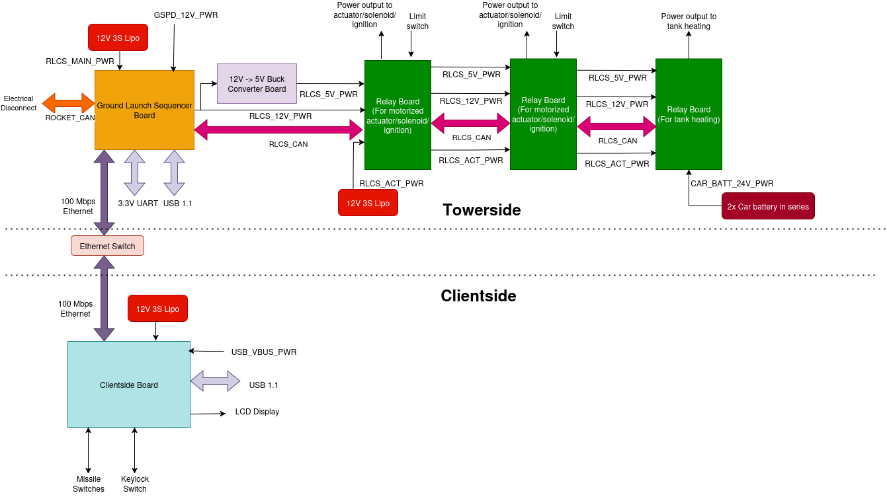

Remote Launch Control System (RLCS) V4
======================================

.. toctree::
   :maxdepth: 2
   :caption: Components

   towerside.rst
   clientside.rst

RLCS V4 is the 4th generation of Waterloo Rocketry's Remote Launch Control System.

The system conprises two parts, one part Towerside is located in EGSE case at test site/launch pad, which is responsible for valve actuation and rocket communication, the other part is Clientside, located at Mission Control, responsible to communcate switch commands to towerside. The clientside and towerside communicate through Ethernet using UDP over IPv4.
   

Requirements
============

.. list-table:: Top level requirements
   :widths: 15 30 55
   :header-rows: 1

   * - Req. ID
     - Description
     - Justification/Parent Requirement
   * - OPS. 1
     - RLCS v4 shall able to fire two 12V 8A ignition line
     - SET THE IGNITION PUCK ON FIRE!!!
   * - OPS. 2
     - RLCS v4 shall able to power three max 26V 25A tank heating line
     - Each tank heating sticker is around 1 ohm resistance, and we would like to provide 600W each
   * - OPS. 3
     - RLCS v4 shall able to actuate 5 ball valve actuators (12V)
     - ?
   * - OPS. 4
     - System shall able to set all actuator to a safe state(a pre defined state) 10 seconds(configurable throught firmware) after lost connection
     - ?
   * - OPS. 5
     - System shall able to safe state all valves without external power(i.e. have redundant power)
     - ?
   * - RLCS. 1
     - Towerside and Clientside shall communicate over a Ethernet based local network
     - Ethernet is a versitile protocol for communicate over a varity of physical media
   * - PM. 1
     - V3 clientside + V4 towerside or V4 clientside + V3 towerside should be compatible with firmware change
     - If timeline is delayed, then we can descope one part and still have partial benefit of new RLCS
