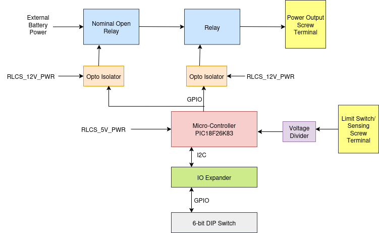

*******************
RLCS V4 Relay Board
*******************

Requirements (RelayBoard)
=========================

.. list-table:: Relay Board Requirements
   :widths: 15 30 55
   :header-rows: 1

   * - Req. ID
     - Description
     - Justification/Parent Requirement
   * - ELEC. 1
     - Board shall have voltage sense on battery line, both power output, 
     - 
   * - ELEC. 2
     - Board shall have current sense on RLCS_5V, RLCS_12V, and both Power output
     - .
