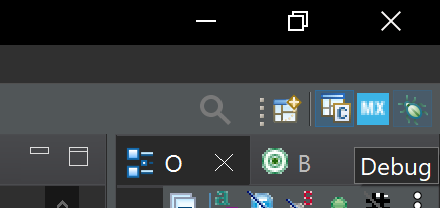

Eclipse IDE Tips
==================
This page contains general tips for developing with Eclipse-based IDEs (STM32CubeIDE, etc)

Git Plugin
------------
1. Install eGit from Eclipse Marketplace: ```Help>Eclipse Marketplace```
2. Enable showing Git diffs in ```Window>Preferences>*use search bar to find "quick diff"*>Use this reference source>A git revision```
3. Restart IDE

Now Git diffs get highilighted as you edit!

Debugging
--------------------
Eclipse uses "Perspectives" which are sets of windows/layouts.
The 2 defaults in STM32CubeIDE are ```C/C++``` for editing code, and ```Debug``` for
running code on target boards in debug mode.



*Top right corner shows perspective icons to manually switch between.
However, it does switch automatically when you flash code via Debug or exit Debug mode
so you don't often need to manually switch.*

When running code in Debug mode/perspective, you should be familiar with the
various windows so you can use the appropriate ones when needed. A few are open by default
but scroll through all of them in ```Window>Show View>...```.

Notable mentions (very commonly used windows to prioritize learning first):

- Variables
- Breakpoints
- Live expressions
- Memory

Keyboard Shortcuts
-------------------
It's essential to learn common useful commands and their keybinds (or set your own bindings).
Go to ```Window>Preferences>General>Keys``` to see all the commands possible. See what you use often
and set keybinds as needed.

Notable mentions (very commonly used commands to prioritize learning first):

- C/C++ References - finds all uses of a function/variable/anything in the entire codebase
- Ctrl+Click - not a keybind, but use this to go to the definition of a function/variable/anything
- Multi-line cursor
- Comment/uncomment line
- Delete a line
