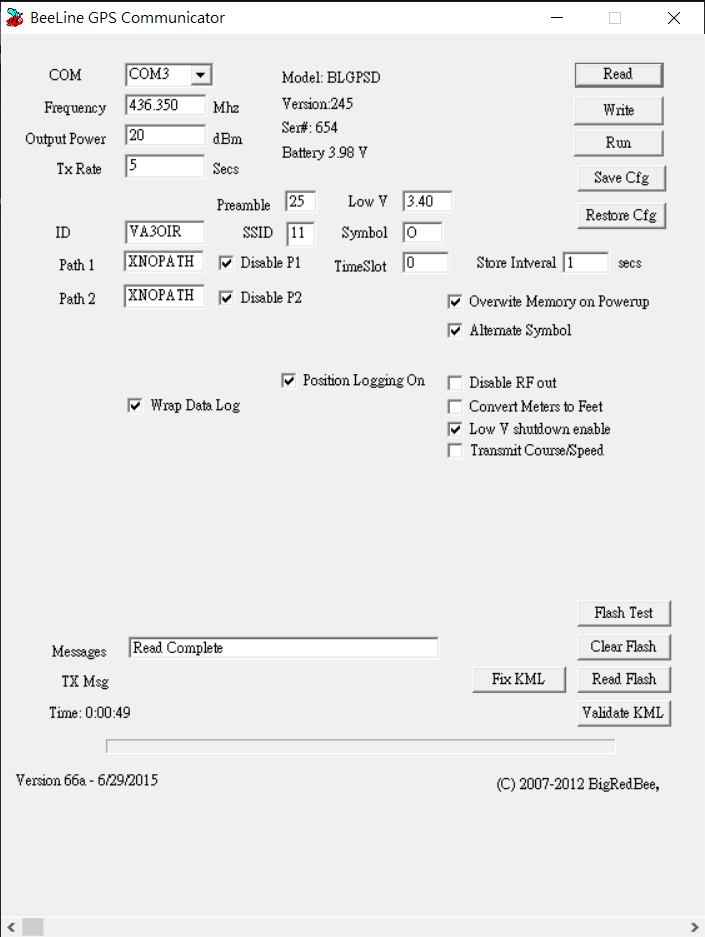
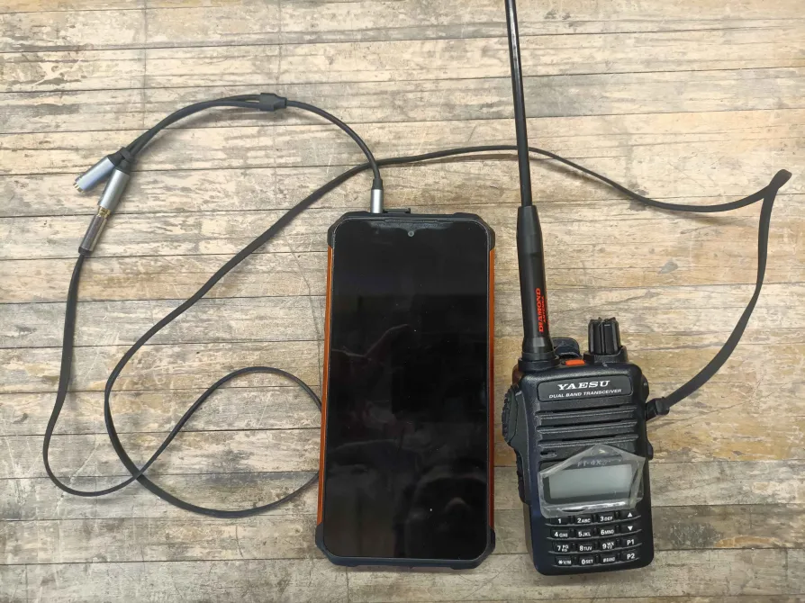
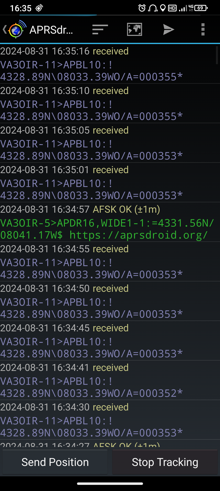
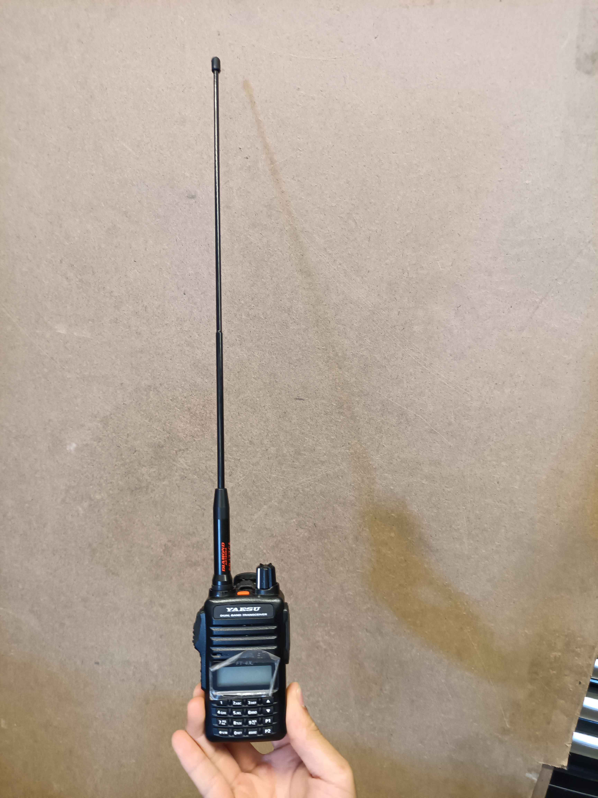

BigRedBee GPS Tracker
=======================
We use BigRedBee's `High Altitude 70cm 100mw GPS/APRS Transmitter <https://shop.bigredbee.com/collections/vhf-uhf-transmitters/products/high-altitude-70cm-100mw-gps-aprs-transmitter>`_ for the COTS tracker requirement.

Configuration
-------------
BRB's documents and programs can be downloaded from https://shop.bigredbee.com/pages/documentation-and-programming-utilities. We need the `70cm and 2meter APRS Transmitter utility <https://cdn.shopify.com/s/files/1/0062/3919/1158/files/BeeLineGPS.066a_1.zip?10068239033136361787>`_. The `User Guide <https://cdn.shopify.com/s/files/1/0062/3919/1158/files/beelineGPS_19.pdf?17310379549075783602>`_ has more detail on the device configuration.

Their program kinda sucks, The step for configuration is

1. Open ``beelinggps.exe``
2. Connect BRB to the computer using ICSP to USB adapter, keep the battery disconnected
3. Select the correct COM port in the program (it would freeze for a bit when selecting the dropdown)
4. Plug the battery into BRB, wait for 1~2 seconds, then click the "Read" button in the program

The timing for step 4 is a bit finicky, and can fail if the read button is clicked either too fast or too slow after BRB is powered. Retry the step a few times if it fails. If the connection succeeds, the current configuration would be read into the utility as shown below

Receiving Packets Using APRSDroid (Android)
-------------------------------------------
APRSDroid is an Android app implementing a software modem. It can be downloaded from https://aprsdroid.org/download/. We want to configure it to use AFSK audio as input, which can be achieved by selecting ``Preferences -> Connection Preferences -> Audio (AFSK)``. In addition you can change the rate your own position updates on the map in ``Preferences -> Location Settings``.

For hardware connection, use a TRS aux cable and a TRS to TRRS adapter to connect the Yaesu FT4x to the phone. **Keep the receive volume below ~1/3 of full volume**, the phone can overheat when receiving too much power from the audio input. Once connected, tracking can be started with the ``Start Tracking`` button in APRSDroid.

If BRB is transmitting GPS nearby, you should see APRS messages in the app every 5 seconds containing its location. BRB takes ~1 minute to start up and lock when GPS reception is good. Adjust the volume of Yaesu so the audio strength indicator at the top of APRSDroid is just at maximum when it is receiving a packet.

APRSDroid supports offline map https://www.aprsdroid.org/osm/, allowing it to be used at launch site where there's no service. https://extract.bbbike.org/ is a good source for offline maps. Simply select the Mapsforge OSM format and a bounding box, and put the generated map in ``/sdcard/aprsdroid.map``. Then in APRSDroid map view, click the eye icon and select ``OpenStreetMap.org`` to switch to the offline map.

Antennas and Range
------------------
Using BRB's stock whip antenna and SRJ77CA on the Yaesu FT4x, the setup using APRSDroid was tested up to 10km line-of-sight. The range is reduced to ~3km if the signal is blocked by trees, buildings, hills, etc. SRJ77CA looks like this

Another factor that can reduce the range is how BRB antenna is mounted in the rocket. It was seen that having the BRB antenna right against the fibreglass tubing drastically changes its properties and makes it less effective. One potential solution is to have the BRB antenna poke out into the air after nosecone separation (hard for integration); or find/modify an antenna so it operates efficiently even when taped onto the fibreglass.

Receiving Packets Using Direwolf (Windows/Linux)
------------------------------------------------
This setup uses Dire Wolf https://github.com/wb2osz/direwolf/releases as software modem to decode audio input. Starting the program would start a AGW server on port 8000 and KISS server on port 8001, either of them can be used by a APRS map program, like APRSISCE/32 http://aprsisce.wikidot.com/downloads or Xastir https://www.xastir.org/index.php/Main_Page to view the location of the rocket.

The hardware connection is the same as for APRSDroid, except if the laptop has its dedicated microphone input, the TRS aux cable can be plugged into it directly instead of using a TRS to TRRS adapter.

We haven't actually used this setup in comp to track the rocket yet, as it is much more realistic to have it running on an Android phone while driving and hiking towards rocket's last known location. But it is kept here if we need it for testing/debugging/other purposes.
