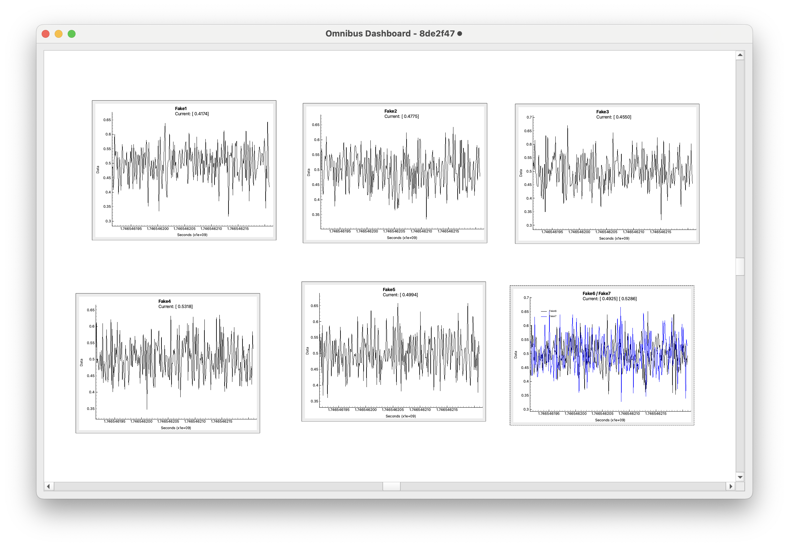

Dashboard
=========

The **Dashboard** is a crucial sink in the Omnibus system. It is a Qt-based GUI application that provides real-time visualization of data from the ZMQ network using various plots.

Key Features
------------

- **User-friendly interface:** Easy to use and intuitive.
- **Real-time monitoring:** Displays live data from multiple sources and channels.
- **Supports multiple data types:** Monitor data from GPS, IMU, DAQ, and other sensors.
- **Flexible visualization:** View data from different sources and channels simultaneously.

The dashboard is designed to help users efficiently monitor and analyze data from the Omnibus system.

Modules
=======

The Dashboard is built with a modular architecture for maintainability and scalability. Each module handles a distinct responsibility, keeping the codebase organized.

.. toctree::
    :maxdepth: 1
    :caption: Dashboard Modules

    dashboardInfo/dashboard
    dashboardInfo/parses
    dashboardInfo/publisher
    dashboardInfo/items

Module Summaries
----------------

- :doc:`dashboardInfo/dashboard`: Main entry point and core logic, managing the GUI and data flow.
- :doc:`dashboardInfo/parses`: Parses and formats incoming data streams for visualization.
- :doc:`dashboardInfo/publisher`: Publishes processed data to the ZMQ network for real-time analysis.
- :doc:`dashboardInfo/items`: Modular widgets and components, such as custom plot items and data displays.

