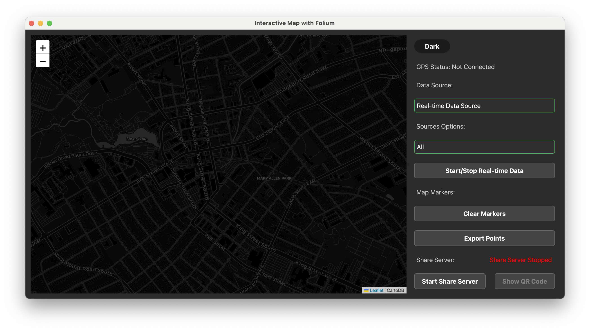

Interamap
=========

.. warning::
    The interamap is under heavy development, which means you can expect breaking changes and bugs.

Interamap is a offline interative map that can display real-time geographic information from the ZMQ network (Source).

Usage
~~~~~
The interamap sink runs with no arguments and it will start up a PyQt window. The sink can be started with the following command:

.. code-block:: bash

    python sinks/interamap/main.py

You can select Data Sorce from the dropdown list, and the map will display the geographic information from the selected source.

1. **Real-time Data**: The map will display the real-time geographic information read from the ZMQ network.
    We support to choose the data source from different GPS board, such as `GPS`, `PROCESSOR` and `FAKE GPS`.
2. **History Data**: The map will display the historical geographic information read from the KMZ file.
    You can choose the KMZ file from the file dialog, and the map will display the geographic information from the selected KMZ file.
    
    .. caution::
        Feature It can replay the historical geographic information from the KMZ file based on the timestamp. (On development)

The interamap sink can be stopped by pressing ``Ctrl + C`` or closing the window.

Development Information
~~~~~~~~~~~~~~~~~~~~~~~

Environment Setup
-----------------

**Lanugaue**: Python (3.11+), HTML, CSS, JavaScript

**Dependencies**: 
    - pip package: PySide6, fastkml, offline_folium, folium, geocoder
    - system package: Tileserver, Tilemaker (Optional)
    - external dataset: Mbtiles Data

Development Road Map
--------------------

- [x] Function to update the map in real-time.
- [x] Support to replay the historical geographic information from the KMZ file based on the timestamp.
- [x] Support to export the real-time geographic information to the KMZ file.
- [x] Support to generate QR code for sharing the export KMZ file.
- [x] Support to display the geographic information from the different data source on the same map.
- [x] Dark mode support for offline map.
- [x] Hardware-in-the-loop (HIL) simulation for testing the interamap sink.
- [ ] Support editing the geographic information on the map.
- [ ] tile server stability and performance improvement.
- [ ] Support satellite map for offline maps.

Project Structure
-----------------

.. code-block:: text

    omnibus/sinks/interamap/
    ├── main.py          # The main entry point of the interamap sink.
    ├── src/            # The folder that contains the source code for the interamap sink.
    │   ├── __init__.py # The init file of the interamap sink.
    |   ├── config.py        # The configuration class that handles the configuration of the interamap sink.
    |   ├── data_stream.py # The data stream class that handles the ZMQ network.
    |   ├── kmz_parser.py  # The kmz parser class that handles the KMZ file.
    |   ├── real_time_map.py # The real-time map class that handles the real-time map display from the ZMQ network.
    |   ├── main_window.py # The main window class that handles the main window of the interamap sink.
    |   ├── map_view.py    # The map view class that handles the map view of the interamap sink.
    │   ├── gps_cache.py   # Storage gps information in cache                                                                           
    │   ├── http_server.py                                                   
    ├── interamap.py     # The main class of the interamap sink.
    ├── main.py         # The main entry point of the interamap sink.
    ├── schema.kml                                                                                             
    ├── tilwserver.py    # The tile server class that handles the tile server of the interamap sink.
    ├── resources                                                                                         
    |   ├── mbtiles/     # The folder that contains the mbtiles data for the offline map. (Ex. ontario-latest.osm.mbtiles)
    │   │   └── ontario-latest.osm.mbtiles  (Could be downloaded from https://drive.google.com/drive/u/1/folders/1nIU1vqQJ2A0i9TZeG5T14Rajfa-ljGfe)                                                         
    |   └── styles/      # The folder that contains the styles for the interamap sink, qss file.
    │       ├── darkmode.qss                                                                                  
    │       └── lightmode.qss                                                                                
    ├── requirements.txt # The requirements file for the interamap sink.
    ├── README.md        # The README file for the interamap sink that contains the usage and development information.
    └── tests/           # The folder that contains the tests for the interamap sink.
    │   └── test_gps_cache.py                                                
    └── tileserver.py   # The tile server class that handles the offline tile server of the interamap sink.

Development Guidelines
----------------------
This sink is majorly based on PySide6 frontend, folium map is build with a webview and injected into the PySide6 window. 
The backend is based on the ZMQ network to receive the real-time geographic information. The sink is designed to be modular and extensible, 
so it can be easily integrated with other sinks. 

We inivite different parsers to parse the geographic information from the different data source, such as `kmz_parser.py` and `real_time_parser.py`.

Parse major input is data stream / file path, and output is a stream of data defined in the `data_stream.py` file. 

After the data is parsed, the data will be displayed on the map view, we will need to storage the data in the map view class (Since we may need to 
export the data to the KMZ file in the future). Map view class should be updated with listener pattern, so the map view can be updated in real-time.

To support the off-line map, we need to use the Tileserver to self-host the map tiles, and point the map view to the local tile server. (Keep a layer of online
map at bottom even the offline map is display on top). You need to change **ONLINE_MODE = True** in the `config.py` to invite this expremental feature.

When we need to export the data, we need to call a export function in the map view class, and the data will be exported to the KMZ file. 
At the same time, we will need to start a http server to host the KMZ file, and generate a QR code for sharing the KMZ file.

After all the work is done, we need to implement grateful exit function to close the ZMQ network and the tile server and the http server. 
Distroy all the object and close the window (Make sure there is no dangling pointer for the PyQt object cause the memory leak).

**Developed with the following guidelines:**

1. **Modular Design**: The sink is designed to be modular and extensible, so it can be easily integrated with other sinks.
2. **Code Quality**: The sink is developed with high code quality, so it is easy to read, maintain, and extend.
3. **Robustness**: The sink is developed with robustness in mind, so it is reliable and stable.
4. **Documentation**: The sink is well-documented, so it is easy to understand and use.
5. **Testing**: The sink is well-tested, so it is trustworthy and bug-free.

Development Workflow
--------------------
Follow `CONTRIBUTING.md <https://github.com/waterloo-rocketry/omnibus/blob/master/CONTRIBUTING.md>`_
